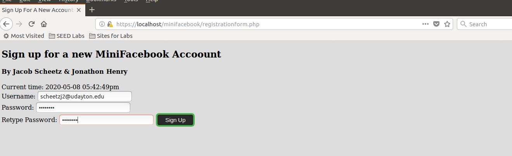
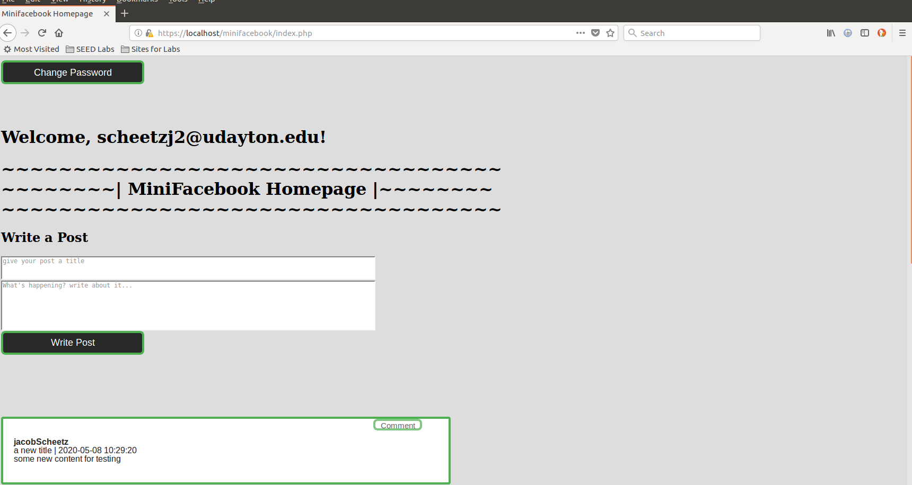
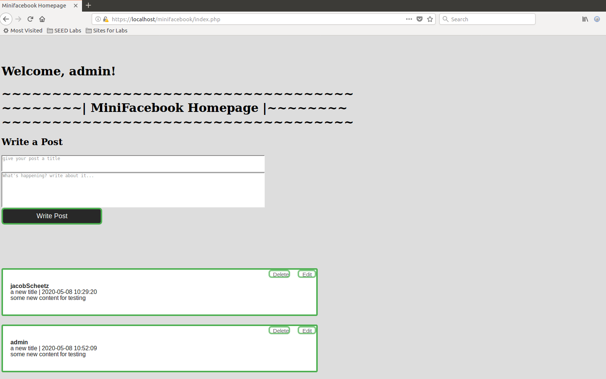
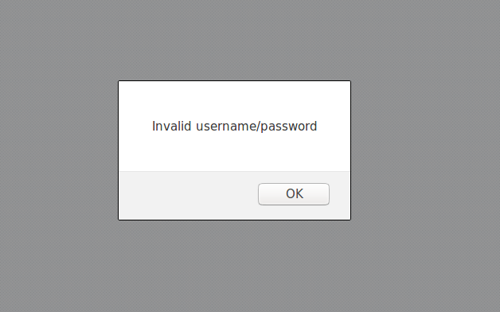
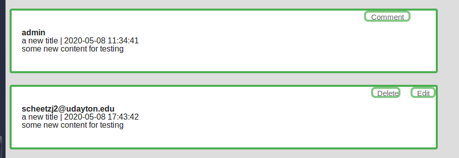
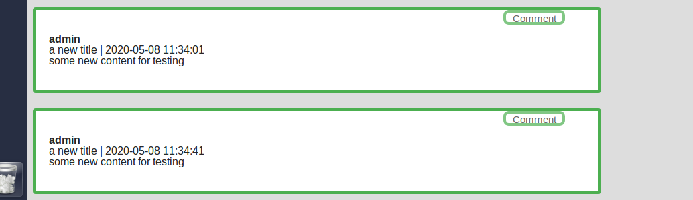

### CPS 475/575 Secure Application Development

# Final Report Template

Names: Jacob Scheetz, Johnathan Henry__  
Instructor: Dr. Phung__   
ID #'s: 1015372081, 1014656801__ 
Course: CPS 475, Secure Application Development__ 
Team emails: scheetzj2@udayton.edu, henryj14@udayton.edu__

# Video demo link 
* https://www.youtube.com/watch?v=PZk2nQa-6Eo&feature=youtu.be

# 1. Introduction

Our project is a secure implementation of a social media site that is protected against some of the most common cyber attack methods. The development of our site took place in three phases where we implemented differnt aspects of the site in a secure fashion. Through the process of developing this site, we were able to gain useful new skills in php programming and working with databses in web applications. If you would like to check out our project further, the repository for our code can be found here: (https://bitbucket.org/secad-henryj14-scheetzj2/secad-project/src/master/ "Site Repository")

# 2. Design

*   Database design: To fully encompass the processes that we wanted to be functional on the website we needed a strong database design. To begin designing our databse we put in a table that held our users. Since this table stored sensitive personal data such as passwords, full names, etc. We encrypted certain fields as a means of a last line of defense. The other table that we put into this databse was the table storing the posts. The key design element of this table was our implementation of a post ID that automatically incremented everytime a post was inserted to this table. This allowed us to then call back to posts that had been previously sent to the website for modification.  
*   UI design: Our goal with the UI of the website was simple. We wanted the website to integrate it's pages together so that it worked as a cohesive unit and it so that it appeared user friendly. Since this was project was mainly for learning purposes, I decided to desgin the UI with CSS from scratch so that I could learn to use CSS for future reference and make it a skill. 
*   Functionalities: Functionalities of our website include a secure login system, ability for a user that's logged in to change their password, a homepage that displays all the posts made to the website, a user can post to the homepage, a user can edit a post that they posted to the homepage, a user can delete their own posts, a user can comment on another user's post, a super user can delete anyone's posts  _How do you separate the roles of regular users (with registration) and the super users?_

# 3. Implementation & security analysis

_Include a brief explanation of your implementation and the security aspects based on the following questions:_

*   We applied secure programming principles in this project such as input validation, access control and output sanitization by being aware of when the user was actually sending information to the database and communicating with the website. 
*   We implemented an approach of defense in depth by stacking our security measures on top of each other. For example, on top of validating the inputs that the user gave us, we encrypted the passwords in the database so that they cannot be obtain through a SQLi attack
*   We implemented rules fo database security while developing this project as well by using prepared sql statements so that only what we want queried is what is queried. 
*   Our code is robust in the fact that we spent a lot of time looking over and debugging the functionalities of our site to do exactly what we wnat them to do and only that.
*   Our code defends against attacks such XSS by not validating the inputs on our site so that no scripts can be run. It also defends against CSRF by using a session token and setting a lifetime for each users session. We defend against SQLi attacks with the use of preppared sql statements to ensure that we are querying exactly what is necessary. 
*   To add access control to our model of security, we implemented super-users to have control over the regular users that are registered normally thorugh the registration page. We separated them by design in the users table by giving them an "enabled" attribute. The only way to obtain an enabled status is for it to be done internally which eliminates the attack surface for someone to register themselves as an enabled users on the registration page.

# 4. Demo (screenshots)

_You need to capture screenshots to demonstrate how your web application works. The screenshots must be accompanied by a short description of its functionalities following the implementation as below:_

*   Everyone can register a new account and then login
	 
*   Superuser can disable an account 
	
    *   The disabled account cannot log in
    [user enabled]("enabled.png")

    *   Superuser can enable the disabled account
    
    *   The enabled user can log in
*   A regular logged-in user can delete her own existing posts, but cannot delete the posts of others
	 
*   CSRF attack to delete a post should be detected and prevented

*   A logged-in user can have realtime chat with other logged-in users
    

# Appendix

text of the code is located in their respective files in this folder.